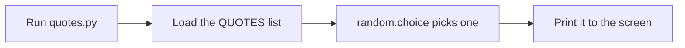
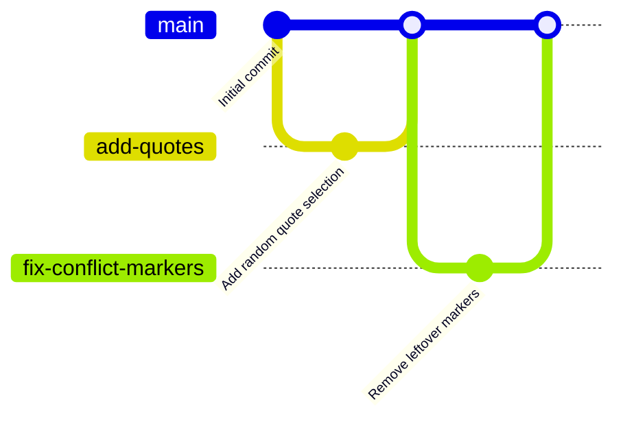

# 💬 Quotes


A tiny Python script that prints a random quote. It exists to practise **git and GitHub**: branches, pull requests, merge conflicts, and rebuilding a project from its repo.

## ✨ Features

- Prints a random quote each time you run it
- One file, no dependencies, nothing to install
- A safe place to practise breaking things and fixing them

## 🚀 Quick start

```bash
git clone https://github.com/G0nz0uk/quotes.git
cd quotes
python3 quotes.py
```

Example output:

```
Quote of the day: Simplicity is prerequisite for reliability. - Edsger Dijkstra
```

## 🧠 How it works



## 📁 Project structure

```
quotes/
├── quotes.py     # the script
├── README.md     # this file
└── .gitignore    # files git should ignore
```

## 🌿 Git workflow used in this repo

Every change goes on a branch, then into `main` through a pull request.



## 🗺️ Roadmap

- [x] Print a random quote
- [x] Practise branches and pull requests
- [x] Practise fixing a merge conflict
- [ ] Add more quotes
- [ ] Read quotes from a separate file
- [ ] Add a `--list` option to show every quote

## 🤝 Making a change

1. `git switch -c my-change` to create a branch
2. Edit, then `git add .` and `git commit -m 'Describe change'`
3. `git push -u origin my-change`
4. `gh pr create --fill` and merge the pull request on GitHub
5. `git switch main` and `git pull`

## 👤 Author

Made by [@G0nz0uk](https://github.com/G0nz0uk) while learning git.
